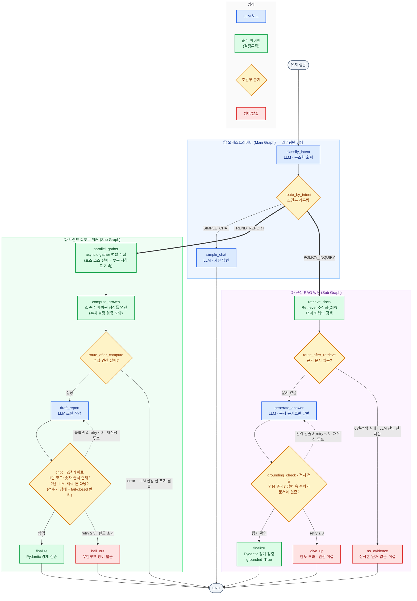

# AI Customer Support & Trend Report Agent Hub

> **한 문장 요약**
> LangGraph로 구현한 **마스터-워커 에이전트 허브** — 고객 문의를 의도 분류해 라우팅하고,
> 트렌드 리포트는 **병렬 수집 · 코드 기반 연산 · 자가 수정 루프**로,
> 규정 문의는 **RAG(검색 추상화 + 결정론적 접지 검증)** 로 환각 없이 답하며,
> **모든 LLM/외부 API 장애 지점에 명시적 저하 정책**을 두고
> **골든셋 기반 자동 평가(CI)** 로 분류 성능을 검증한다.

B2B SaaS 고객지원을 가정한 에이전트 오케스트레이션 프로젝트입니다. 단순 토이가 아니라
**클린 아키텍처(DIP/SRP)** 와 **하네스 엔지니어링(골든셋·투트랙 테스트)** 철학을 코드로 구현하는 데
초점을 맞췄습니다.

---

## 핵심 아키텍처

요청 → 의도 분류 → 라우팅 → (트렌드 워커: 병렬 수집·연산 분리·자가 수정 루프) → 검증까지,
전 모듈이 어떻게 이어지는가.



**읽는 법:**
- **굵은 화살표(`==>`)** = 메인 → 워커로 라우팅되는 핵심 경로(TREND_REPORT / POLICY_INQUIRY)
- **점선 화살표(`-.->`)** = 검수/접지 불합격 시 되돌아가는 **자가 수정 루프** (두 워커 모두 동일 패턴)
- `route_after_compute` / `route_after_retrieve` = 필수 입력이 없으면 **LLM 단계에 진입하기 전에**
  끊는 방어 분기 — RAG 쪽은 "근거 없는 답변 = 100% 환각"이므로 환각이 생성될 기회 자체를 차단
- 색이 곧 노드의 성격: 🟦 LLM · 🟩 순수 코드 · 🟧 분기 · 🟥 방어 탈출/정직한 거절
- 핵심 메시지: **수치 연산·접지 검증·계약 확정은 초록(코드), 생성·의미 검수는 파랑(LLM)** —
  "LLM은 언어, 코드는 연산"이 색으로 분리돼 보인다.

---

## 설계 결정과 "왜"

| 결정 | 이유 |
|---|---|
| **마스터-워커 분리** (`main_graph` / `sub_graphs`) | 메인은 라우팅만, 서브는 업무만. SRP·낮은 결합도. 새 워커(예: 환불 처리)를 레고처럼 추가해도 메인 불변. |
| **LLM 공급사 추상화** (`LLMProvider` ABC + 팩토리) | **DIP**: 노드는 구체 LLM(OpenAI)이 아니라 추상 계약에 의존. OpenAI→Claude 교체 시 노드 코드 0줄 수정. 노드별 독립 주입(예: Orchestrator=OpenAI, Critic=Claude) 가능. |
| **성장률을 LLM이 아닌 코드로 연산** (`compute_growth`) | LLM은 언어 모델이라 산수를 환각한다. 정확도가 생명인 수치는 결정론적 파이썬으로. "LLM은 언어, 코드는 연산." |
| **2단 Critic 게이트** (코드 → LLM) | 코드 게이트만으론 형식만 맞춘 쓰레기("0% 같습니다")를 못 거르고, LLM 게이트만으론 검수자도 환각한다. 싼 코드 게이트로 1차 컷(LLM 호출 절감=비용↓), 통과분만 LLM이 맥락·톤 검수. |
| **`retry_count` 무한루프 방어** | 초안↔검수 핑퐁이 무한 반복되면 API 요금 폭탄·크래시. 최대 3회 후 에러로 우아하게 탈출. |
| **경계마다 Pydantic 검증** (`schemas.py`) | 그래프 경계를 넘는 데이터는 런타임 계약 강제. "타입이 아니라 계약. 위반은 경계에서 막는다." 내부 작업 메모리(State)는 가벼운 TypedDict로 구분. |
| **검색(Retriever) 추상화** (`retrieval/` — ABC + 팩토리) | LLM 추상화와 같은 DIP 패턴. RAG 워커는 `Retriever` 계약만 안다. 더미 키워드 검색 → 하이브리드 검색(Vector+BM25) 교체 시 워커 코드 0줄 수정, 레지스트리 1줄 등록이면 끝. |
| **접지 검증(Grounding)은 코드로** (`_grounding_gate`) | "환각을 잡는 검증기가 스스로 환각하면 방어가 아니다." 인용 존재 + 답변 속 모든 수치의 문서 실존 여부를 결정론적 코드로 검사. 규정 답변에서 가장 치명적인 '그럴듯한 거짓 숫자'를 잡는다. |
| **정직한 거절도 정상 산출물** (`PolicyAnswerOutput.grounded`) | 근거가 없으면 지어내는 대신 "문서에서 찾지 못했다"고 답한다. grounded=True인데 인용이 없는 모순은 Pydantic validator가 경계에서 차단. |
| **투트랙 테스트** (mock / real) | 매 Push마다 실제 API를 부르면 느리고 비싸다. 평소 CI는 mock으로 로직만 검증, 정확도 측정은 수동 트리거(real)로. 비용 최적화 + 안정성. |

---

## 장애 대응 설계 (Failure Policy)

전제: **"LLM 호출과 외부 API는 실패한다. 예외 상황이 아니라 일상이다."**
그래서 모든 장애 지점마다 '어떻게 저하(degrade)할지'를 명시적으로 결정했고,
각 정책은 죽은 공급사(`_DeadProvider`)를 주입하는 테스트로 검증된다.

| 장애 지점 | 정책 | 왜 이 정책인가 |
|---|---|---|
| 의도 분류 LLM 실패 | **SIMPLE_CHAT으로 폴백 라우팅** | 라우터의 실패가 허브 전체의 크래시가 되어선 안 된다. 가장 안전한 기본 경로로 보낸다. |
| 답변(simple_chat) LLM 실패 | **정중한 고정 문구 + `error` 기록** | 고객에게 스택트레이스 대신 사과를. 원인은 error 필드·로그로 추적 가능하게. |
| 빈 질문 입력 | **LLM 호출 없이 재질문 안내** | 코드로 처리 가능한 입력에 LLM 비용을 쓰지 않는다(상류 컷). |
| 시장 데이터(필수 입력) 수집 실패 | **LLM 진입 전 조기 탈출(abort)** | 데이터 없이 초안 LLM을 부르면 비용 낭비 + 근거 없는 환각 보고서 위험. 실패는 상류에서 끊는다. |
| 경쟁사 데이터(보조 입력) 수집 실패 | **부분 저하(degraded)로 계속 진행** | 보조 입력의 실패는 전체 실패가 아니다. 시장 데이터만으로 보고서를 완성한다. |
| 초안 작성 LLM 실패 | **빈 초안 반환 → 기존 자가 수정 루프가 재시도를 겸함** | 빈 초안은 코드 게이트가 반드시 반려 → 루프가 재호출. 별도 재시도 로직 0줄로 일시 장애 회복, 지속 장애는 `bail_out` 수렴. |
| 검수(LLM 게이트) 실패·빈 응답 | **fail-closed 반려** | 검수 불가 시 '무검수 통과(fail-open)'는 검증 안 된 보고서를 고객에게 내보내는 것 — 반려가 더 안전하다. |
| 수집 데이터의 수치 불량(타입·누락) | **크래시 대신 `error` 전환 + 조기 탈출** | 외부 검색 결과는 신뢰하지 않는다. `TypeError` 크래시가 아니라 명시적 실패로. |
| RAG: 검색 결과 0건 | **LLM 진입 전 정직한 '근거 없음' 거절** | 근거 없는 생성은 100% 환각이다. 비용 절감을 넘어 환각이 생성될 기회 자체를 차단. |
| RAG: 검색기(벡터 DB 등) 장애 | **`error` 기록 + 정직한 거절 답변** | 고객 응대 경로는 어떤 경우에도 답변 계약(PolicyAnswerOutput)을 만족하는 응답을 반환한다. |
| RAG: 접지 실패(환각) 반복 | **재작성 루프 → 한도 초과 시 안전한 거절** | 그럴듯한 거짓 답변을 내보내느니 "담당자 확인 후 안내"가 낫다(fail-safe). |

이와 별개로 **코드 게이트의 숫자 검사는 정규식 경계 매칭**을 쓴다 — 단순 부분 문자열 검사는
`"115.4억"` 속의 `15.4`를 오탐하고, `growth=15.0`일 때 자연스러운 표기 `"15%"`를 미탐하기 때문이다.

---

## 관찰가능성 (Observability)

- 전 모듈이 `logging_config.get_logger()` 공용 로거 사용 (`print` 금지).
- **INFO**: 운영 판단에 필요한 결과 — 분류 결과, 성장률 연산값, Critic 합/반려(+사유), 최종 확정.
- **DEBUG**: 디버깅 근거 — 분류 reasoning(가장 자주 틀리는 지점이라 일부러 받는 필드), 초안 작성 시점.
- **WARNING/ERROR**: 모든 저하·탈출 지점 — 폴백 라우팅, 부분 저하, fail-closed 반려, 루프 한도 초과.
- `LOG_LEVEL=DEBUG` 환경변수 하나로 전환. 운영 기본은 INFO.

---

## 프로젝트 구조

```
CLAUDE.md                 # 프로젝트 헌법 — 불변 원칙·가드레일·AI 협업 규칙 (아래 참고)
src/
├── state.py              # 그래프 공용 상태(TypedDict) — 노드 간 데이터 버스
├── schemas.py            # 경계 계약(Pydantic) — Intent/TrendReport/PolicyAnswer
├── logging_config.py     # 공용 로거(print 대신 logging, 레벨 제어)
├── main_graph.py         # 오케스트레이터: 의도 분류 + 조건부 라우팅 + 폴백 방어
├── llm/                  # ── LLM 공급사 추상화(DIP) ──
│   ├── base.py           #    LLMProvider(ABC) : 추상 계약 + content 텍스트 강제 변환
│   ├── openai_provider.py#    OpenAI 구현체
│   └── factory.py        #    get_provider() : 주입 단일 지점(레지스트리=OCP)
├── retrieval/            # ── 문서 검색 추상화(DIP, llm/과 동일 구조) ──
│   ├── base.py           #    Retriever(ABC) + RetrievedDoc : 검색 계약
│   ├── dummy_retriever.py#    결정론적 키워드 더미 검색(사내 규정 코퍼스 내장)
│   └── factory.py        #    get_retriever() : 하이브리드(Vector+BM25) 교체 지점
└── sub_graphs/
    ├── trend_report.py   # 워커①: 병렬수집·연산·초안·2단Critic·루프/장애 방어
    └── rag_worker.py     # 워커②: 검색·생성·접지 검증(환각 방어)·정직한 거절

tests/
├── test_cases.json       # 골든셋 14개(키워드는 겹치나 의도는 반대인 함정 포함)
├── test_harness.py       # 분류 정확도 채점기(투트랙: mock/real)
├── test_unit.py          # 단위 54개(연산·게이트·라우터·계약·검색·접지·장애 방어)
└── test_integration.py   # 통합 19개(라우팅·서브그래프·환각 자가수정·저하 시나리오)

scripts/
└── run_e2e.py            # 실제 OpenAI로 전체 그래프 완주 확인(수동, 비용 발생)

.github/workflows/run_tests.yml   # CI: push=mock 자동, 수동 트리거=real
```

---

## 빠른 시작

```bash
# 1) 의존성 설치
pip install -r requirements.txt

# 2) 환경 설정 (.env.example을 복사해 .env로 만들고 키 입력)
cp .env.example .env
#   → .env의 OPENAI_API_KEY를 실제 키로 교체

# 3) 자동 테스트 (mock 모드 — API 키 불필요, 무료/빠름)
pytest -v

# 4) 분류 정확도 실측 (real 모드 — 실제 OpenAI 호출, 비용 발생)
TEST_MODE=real pytest -v -k accuracy        # PowerShell: $env:TEST_MODE="real"; pytest ...

# 5) 전체 그래프 E2E 완주 확인 (실제 API)
python scripts/run_e2e.py
```

> **로그 레벨**: `LOG_LEVEL=DEBUG`로 실행하면 의도 분류의 근거(reasoning)까지 출력됩니다.
> 분류가 가장 자주 틀리는 지점이라, 디버깅을 위해 근거를 관찰 가능하게 남겨뒀습니다.

---

## 테스트 전략 (테스트 피라미드)

| 층 | 파일 | 검증 | 특징 |
|---|---|---|---|
| 단위 | `test_unit.py` | 부품 하나 격리(연산·게이트·라우터·계약·검색·접지) | 빠름, 실패 시 원인 즉시 식별 |
| 통합 | `test_integration.py` | 조립된 그래프 흐름(분기·루프·환각 자가수정·저하) | FakeProvider로 결정론적 검증 |
| 골든셋/E2E | `test_harness.py`, `scripts/run_e2e.py` | 분류 정확도 / 실제 완주 | 투트랙(mock/real) |

자동 테스트 **74개** 전부 mock으로 돌아 **CI에서 무료·결정론적**으로 통과합니다.
장애 테스트는 실제 장애를 일으키는 대신 **'죽은 공급사/고장난 검색기'를 주입**하는 방식이라 —
LLM·검색 추상화(DIP)가 테스트 가능성(testability)으로 직결됨을 보여주는 증거이기도 합니다.

---

## AI 협업 헌법 (`CLAUDE.md`)

이 저장소에는 AI 코딩 어시스턴트와 협업하기 위한 **프로젝트 헌법**이 포함되어 있습니다.
매 스텝을 지시하는 대본이 아니라, **불변 원칙**(마스터-워커 분리, DIP, "LLM은 언어·코드는 연산",
경계 Pydantic·내부 TypedDict, 모든 루프에 탈출 장치)과 **검증 가드레일**
(수정 후 반드시 테스트 자가 실행 → 100% 통과 전 완료 선언 금지, 새 동작에는 새 테스트,
아키텍처 변경·릴리즈는 인간 승인 필수)을 정의합니다.
→ "AI에게 절차가 아니라 **판단 기준**을 주면, 세부 구현은 위임해도 품질이 유지된다"는
운영 방식 자체가 이 포트폴리오의 일부입니다.

---

## 기술 스택

LangGraph · LangChain · OpenAI · Pydantic v2 · pytest / pytest-asyncio · GitHub Actions
